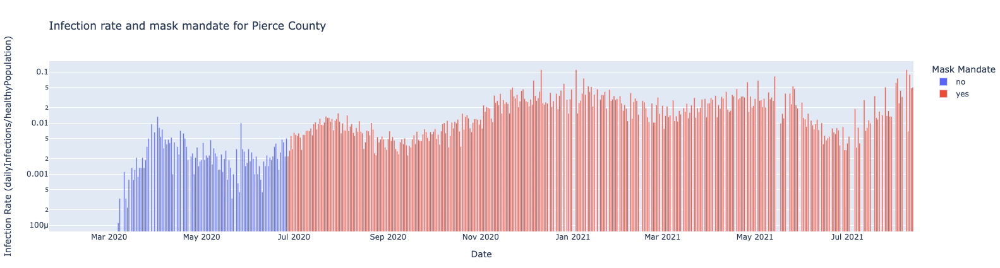

### Goal
The goal of this project is to understand the impact of mask mandate in Pierce County, WA. 

### Description
This repository contains code to analyze the impace of mask mandate in Pierce County, WA. Data comes from the US government, NYT, and Kaggle. 

### Usage
Acquire the data from the below references, move it to this repositories datat directory (`./data`), and run the notebook. Everything is reproducible given the raw data. 

### Data
Data is acquired from the following internet sources:
* https://www.kaggle.com/datasets/antgoldbloom/covid19-data-from-john-hopkins-university
* https://data.cdc.gov/Policy-Surveillance/U-S-State-and-Territorial-Public-Mask-Mandates-Fro/62d6-pm5i
* https://github.com/nytimes/covid-19-data/tree/master/mask-use

### Reflection
The analysis was hamstrung by the available information. That is, out of all the afrorementioned sets of data, only a handfule of variables were applicable; this simply is not enough information to accuartely model the complexites of literal viral proliferation. We cannot proceed further without making major assumptions, for which we are unqualified. 

For example, we only have CDC recommendation adherence (with respect to masking in public) estimates for a single point in time. How, then, can rigiously assess the impacts of a mask mandate without knowing how such a mandate impacts adherence? We can't, not without treading into potentially falacious territory. 

Looking at the plot, we can see that the infection rate began to decline about a month after the mandate whent into effect. Ater about a month, it started to increase again. With the data we have, the best can do is note the correlation between the decreased infection rate (albeit delayed) and the mask policy. 

Collaboration was useful, If nothing else, it gave me confidence to accept that my result was, at best, inconclusive. I did not use anyone's code. 

