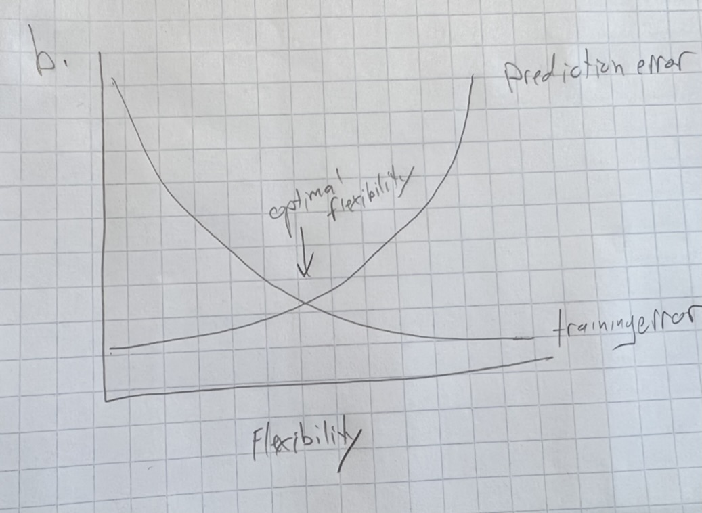
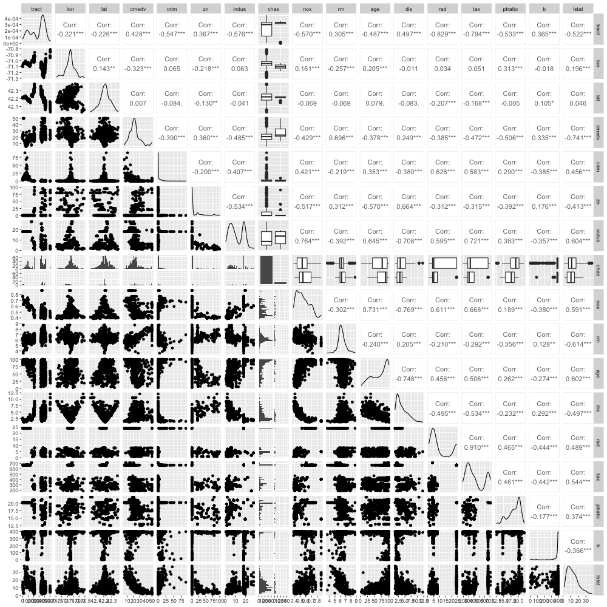

```{R setup, include=FALSE}
library(ggplot2)
library(GGally)
library(class)
library(tidyverse)
library(cowplot)

rm(list=ls())

pp <- function(...) {
    print(paste0(...))
}
```

## 1. Suppose that you are interested in performing regression on a particular dataset, in order to answer a particular scientific question. You need to decide whether to take a parametric or a non-parametric approach.

### (a) In general, what are the pros and cons of taking a parametric versus a non-parametric approach?
The pros of one model type are considered cons of the other. 
Pros of parametric models:
* Often requires less training data
* Train faster since they have fewer parameters
* Tend to be more interpretable 
* Depending on the selected parametric model, we can do inference! 

Pros of non-parametric models:
* Do not need to assume a distribution of the underlying data
    * In general, far fewer assumptions required
* Flexibility easily attained, e.g. with k-nearest-neighbor, one need simply lower the value of k
    * (this can be a double edged sword a la overfitting)
* Require less feature engineering

### (b) What properties of the data or scientific question would lead you to take a parametric approach?
We'd reach for a parametric model we can assume, with relative confidence, the distribution of the data. Also, because parametric models do not require a number of parameters proportional to dimensions of the input data (constant number of parameters), they can be more space efficient and faster to train.

### (c) What properties of the data or scientific question would lead you to take a non-parametric approach?
Non-parametric models are appropriate when the distribution of the data is unknown and we cannot make any assumptions or when we do not need to perform inference. 

## 2. In each setting, would you generally expect a flexible or an inflexible statistical machine learning method to perform better? Justify your answer.

### (a) Sample size n is very small, and number of predictors p is very large.
Since sample size is small, a flexible model will likely overfit. So, in spite of the large number of predictors, I'd select a model that is less flexible.

### (b) Sample size n is very large, and number of predictors p is very small.
Here, it's safer to use a flexible model. More data means means smaller standard error, so we are less likely to fit noise and more likely to fit the true $f$ of the data.

### (c) Relationship between predictors and response is highly non-linear.
Flexible model, or at least a model more flexible than a linear model, which cannot hope to approximate a non-linear relationship. 

### (d) The variance of the error terms, i.e. $\sigma^2 = Var(\epsilon)$, is extremely high.
Less flexible, since high error variance could be a sign that the data is noisy. A more flexible model would fit this noise. 

## 3. For each scenario, determine whether it is a regression or a classification problem, determine whether the goal is inference or prediction, and state the values of n (sample size) and p (number of predictors).

### (a) I want to predict each student’s final exam score based on their homework scores. There are 50 students enrolled in the course, and each student has completed 8 homeworks.
Regression or Classification: regression, since the dependent variable is continuous
Inference or prediction: prediction
n: 50 students
p: 8 homework assignments

### (b) I want to understand the factors that contribute to whether or not a student passes this course. The factors that I consider are (i) whether or not the student has previous programming experience; (ii) whether or not the student has previously studied linear algebra; (iii) whether or not the student has taken a previous stats/probability course; (iv) whether or not the student attends office hours; (v) the student’s overall GPA; (vi) the student’s year (e.g. freshman, sophomore, junior, senior, or grad student). I have data for all 50 students enrolled in the course.
Regression or Classification: classification, since the output is discrete and finite (two categories)
Inference or prediction: inference, we are trying to gain understanding
n: 50
p: 6

## 4. This problem has to do with the bias-variance trade-off and related ideas, in the context of regression. For (a) and (b), it’s okay to submit hand-sketched plots: you are not supposed to actually compute the quantities referred to below on data; instead, this is a thought exercise.

### (a) Make a plot, like the one we saw in class, with “flexibility” on the x-axis. Sketch the following curves: squared bias, variance, irreducible error, reducible error, expected prediction error. Be sure to label each curve. Indicate which level of flexibility is “best”.
```{r , echo=FALSE, out.width = '100%'}
knitr::include_graphics("hw1_q4a.png")
```

### (b) Make a plot with “flexibility” on the x-axis. Sketch curves corresponding to the training error and the test error. Be sure to label each curve. Indicate which level of flexibility is “best”.
```{r , echo=FALSE, out.width = '100%'}

```

### (c) Describe an $\hat{f}$ that has extremely low bias, and extremely high variance. Explain your answer.
A sufficiently high degree polynomial that can intersects every data point in any training set. The parameters of this model would change from training set to training set and would not necessarily provide low test error. And since the model is very sensitive to the data, bias is minimized.

### (d) Describe an $\hat{f}$ that has extremely high bias, and zero variance. Explain your answer.
A constant model, e.g. $\hat{f}_(x) = 0$. Since the model is constant, the can be no variance. However, bias is extremely high because the model ignores all signals in the data. 

## 5. We now consider a classification problem. Suppose we have 2 classes (labels), 25 observations per class, and p = 2 features. We will call one class the “red” class and the other class the “blue” class. The observations in the red class are drawn i.i.d. from a $N_p(\mu_r, I)$ distribution, and the observations in the blue class are drawn i.i.d. from a $N_p(\mu_b, I)$ distribution, where $\mu_r = \binom{0}{0}$ is the mean in the red class, and where $\mu_b = \binom{1.5}{1.5}$ is the mean in the blue class.

### (a) Generate a training set, consisting of 25 observations from the red class and 25 observations from the blue class. (You will want to use the R function rnorm.) Plot the training set. Make sure that the axes are properly labeled, and that the observations are colored according to their class label.
```{R}
generate_q5_data <- function() {
    gen_data <- function(color, mean) {
        df <- data.frame(rep(color, 25), rnorm(25, mean, 1), rnorm(25, mean, 1))
        colnames(df) <- c("color", "feature1", "feature2") 
        return(df)
    }
    return(rbind(gen_data("red", 0), gen_data("blue", 1.5)))
}

# Generate the data
train_set <- generate_q5_data()

# Draw the plot
qplot(feature1, feature2, main="Training Data", color=color, data=train_set) + 
    scale_color_manual(values=c("red"="red", 
                                "blue"="blue"))
```

### (b) Now generate a test set consisting of 25 observations from the red class and 25 observations from the blue class. On a single plot, display both the 2 training and test set, using one symbol to indicate training observations (e.g. circles) and another symbol to indicate the test observations (e.g. squares). Make sure that the axes are properly labeled, that the symbols for training and test observations are explained in a legend, and that the observations are colored according to their class label.
```{R}
test_set <- generate_q5_data()

tmp_train_set <- train_set
tmp_train_set ["meta_usage"] <- "training data"
tmp_test_set <- test_set 
tmp_test_set ["meta_usage"] <- "testing data"

tmp_all_set <- rbind(tmp_train_set, tmp_test_set)

# Draw the plot
qplot(feature1, feature2, main="Training and Test Data", color=color, shape=meta_usage, data=tmp_all_set) + 
    scale_color_manual(values=c("red"="red", 
                                "blue"="blue"))
```

### (c) Using the knn function in the library class, fit a k-nearest neighbors model on the training set, for a range of values of k from 1 to 20. Make a plot that displays the value of 1/k on the x-axis, and classification error (both training error and test error) on the y-axis. Make sure all axes and curves are properly labeled. Explain your results.
```{R}
features <- c("feature1", "feature2")

train_features <- train_set[, features]
train_Y <- train_set[, "color"]
test_features <- test_set[, features]
test_Y <- test_set[, "color"]

errors <<- map_dfr(seq(1, 20), function(k) {
    training_preds <- knn(train_features, train_features, train_Y, k)
    train_error <- mean(training_preds != train_Y) 
    
    test_preds <- knn(train_features, test_features, train_Y, k)
    test_error <- mean(test_preds != test_Y) 
    
    test_set[paste0("k_", k, "_correct")] <- test_preds==test_Y
    assign("test_set", test_set, .GlobalEnv) # I should have read ahead...
    
    list("k"=k, "train_error"=train_error, "test_error"=test_error)#, "test_preds"=test_preds)
})

my_errors <- pivot_longer(errors, c("train_error", "test_error"), names_to="set", values_to="error")

qplot(data=my_errors, x=k, y=error, color=set, geom="line", main="K vs Error (fraction predicted incorrectly)")
```
We see that there is some threshold for which, as $K$ increases, training error surpasses testing error. For this data, the threshold appears to be at $k=3$. Both errors seem to stabilize at roughly $k=6$, where the model's increasing bias ceases to have affect prediction outcomes. It makes sense that training error increases as $k$ increases (up to $~k=6$) since a perfect model (with respect to the training data) is constructed at $k=1$. We also see that peak testing error occurs while the model is over fitting, i.e. where $~k<5$. 

### (d) For the value of k that resulted in the smallest test error in part (c) above, make a plot displaying the test observations as well as their true and predicted class labels. Make sure that all axes and points are clearly labeled.
```{R}
qplot(feature1, feature2, main="Test set: which values were correctly predicted for k=6? ", color=color, shape=k_6_correct, data=test_set) + 
    scale_shape_manual(values = c(4, 1)) + 
    scale_color_manual(values=c("red"="red", 
                                "blue"="blue"))
```

### (e) Recall that the Bayes classifier assigns an observation to the red class if $Pr(Y = red|X = x) > 0.5$, and to the blue class otherwise. The Bayes error rate is the error rate associated with the Bayes classifier. What is the value of the Bayes error rate in this problem? Explain your answer.
The Bayes error rate is less than or equal to our optimal KNN error rate found at $k=6$. KNN estimates the conditional probability $P(Y=red|X=x)$, true, we can never know exactly what it is. However, a simulation could get us close.

```{R}
num_simulations <- 1000
avg_accum <- 0
for(sim_count in 1:num_simulations) {
    best_error <- 1 
    for(k in 1:20) {
        test_preds <- knn(train_features, test_features, train_Y, k)
        test_error <- mean(test_preds != test_Y) 
        if(test_error < best_error) {
            best_error <- test_error
        }
    }
    avg_accum <- avg_accum + best_error
}

avg_best_error <- avg_accum/num_simulations

print(avg_best_error)
```
Assuming KNN gives us a decent approximation of the true distribution, the simulation yields $0.08$ as the optimal Bayes error rate. 

## 6. We will once again perform k-nearest-neighbors in a setting with p = 2 features. But this time, we’ll generate the data differently: let $X_1 \sim Unif[0, 1]$ and $X_2 \sim Unif[0, 1]$, i.e. the observations for each feature are i.i.d. from a uniform distribution. An observation belongs to class “red” if $(X_1 - 0.5)^2 + (X_2 - 0.5)^2 > 0.15$ and $X_1 > 0.5$; to class “green” if $(X_1 - 0.5)^2 + (X_2 - 0.5)^2 > 0.15$ and $X_1 \le 0.5$; and to class “blue” otherwise.

### (a) Generate a training set of n = 200 observations. (You will want to use the R function runif.) Plot the training set. Make sure that the axes are properly labeled, and that the observations are colored according to their class label.
```{R}
assign_color <- function(x1, x2) {
    c <- (x1 - 0.5)^2 + (x2 - 0.5)^2
    if(c > 0.15) {
        if(x1 > 0.5) {
            return("red")
        }
        return("green")
    }
    return("blue")
}

gen_unif_data <- function() {
    as.data.frame(data.frame(x1=runif(200, 0, 1), x2=runif(200, 0, 1)) %>%
        rowwise() %>% 
        mutate(color=assign_color(x1, x2)) %>%
        ungroup())
   
}

train_set <- gen_unif_data()

qplot(data=train_set, x=x1, y=x2, color=color, main="Generated color data") + 
    scale_color_manual(values=c("red"="red", 
                                "blue"="blue",
                                "green"="green"))

```

### (b) Now generate a test set consisting of another 200 observations. On a single plot, display both the training and test set, using one symbol to indicate training observations (e.g. circles) and another symbol to indicate the test observations (e.g. squares). Make sure that the axes are properly labeled, that the symbols for training and test observations are explained in a legend, and that the observations are colored according to their class label.
```{R}
test_set <- gen_unif_data()

tmp_train_set <- train_set
tmp_train_set ["meta_usage"] <- "training data"
tmp_test_set <- test_set 
tmp_test_set ["meta_usage"] <- "testing data"

tmp_all_set <- rbind(tmp_train_set, tmp_test_set)

qplot(x1, x2, main="Q6b: Training and Test Data", color=color, shape=meta_usage, data=tmp_all_set) + 
    scale_color_manual(values=c("red"="red", 
                                "blue"="blue",
                                "green"="green"))
```

### (c) Using the knn function in the library class, fit a k-nearest neighbors model on the training set, for a range of values of k from 1 to 50. Make a plot that displays the value of 1/k on the x-axis, and classification error (both training error and test error) on the y-axis. Make sure all axes and curves are properly labeled. Explain your results.
```{R}
# TODO: combine code with Q5c

features <- c("x1", "x2")

train_features <- train_set[, features]
train_Y <- train_set[, "color"]
test_features <- test_set[, features]
test_Y <- test_set[, "color"]

errors <<- map_dfr(seq(1, 50), function(k) {
    training_preds <- knn(train_features, train_features, train_Y, k)
    train_error <- mean(training_preds != train_Y) 
    
    test_preds <- knn(train_features, test_features, train_Y, k)
    test_error <- mean(test_preds != test_Y) 
    
    test_set[paste0("k_", k, "_correct")] <- test_preds==test_Y
    assign("test_set", test_set, .GlobalEnv) # I should have read ahead...
    
    list("k"=k, "train_error"=train_error, "test_error"=test_error)#, "test_preds"=test_preds)
})

my_errors <- pivot_longer(errors, c("train_error", "test_error"), names_to="set", values_to="error")

qplot(data=my_errors, x=k, y=error, color=set, geom="line", main="K vs Error (fraction predicted incorrectly)")
```
The most striking feature of the visualization is the parallel relationship between testing and training error: as training error increases, so too does testing error--and at approximately the same rate. We also observe minimum test error at $k=1$. I speculate that this can be explained by the non-overlapping nature of the generated data; for reach color region (see plot for Q6b), there are no intruding colors. So, with the exception of a few adjacent to the boundaries between regions, the nearest single neighbor at any point will very likely be the same color. There are many more points not on boundaries than there are on boundaries. For a similar reason, the gap between testing and training error remains relatively constant for each $k$: as $k$ increases, the boundary between color regions widens, encompassing more erroneous points, and since the test data is i.i.d. (but not identically-generated) to the training data, the estimated boundary is offset, causing more errors. 

### (d) For the value of k that resulted in the smallest test error in part (c) above, make a plot displaying the test observations as well as their true and predicted class labels. Make sure that all axes and points are clearly labeled.
```{R}
qplot(x1, x2, main="Test set: which values were correctly predicted for k=1? ", color=color, shape=k_1_correct, data=test_set) + 
    scale_shape_manual(values = c(4, 1)) + 
    scale_color_manual(values=c("red"="red", 
                                "blue"="blue",
                                "green"="green"))
```

### (e) In this example, what is the Bayes error rate? Justify your answer, and explain how it relates to your findings in (c) and (d).
```{R}
num_simulations <- 1000
avg_accum <- 0
for(sim_count in 1:num_simulations) {
    best_error <- 1 
    for(k in 1:50) {
        test_preds <- knn(train_features, test_features, train_Y, k)
        test_error <- mean(test_preds != test_Y) 
        if(test_error < best_error) {
            best_error <- test_error
        }
    }
    avg_accum <- avg_accum + best_error
}

avg_best_error <- avg_accum/num_simulations

print(avg_best_error)
```

## 7. This exercise involves the Boston housing data set, which is part of the ISLR2 library.

### (a) How many rows are in this data set? How many columns? What do the rows and columns represent?
```{R}
library(mlbench)
data(BostonHousing2)
bdf <- BostonHousing2
dim_desc(bdf)
```
The dataset has 506 rows and 14 columns. I provide column descriptions below direct from the Boston package documentation:
crim
per capita crime rate by town.

crim	per capita crime rate by town
zn	    proportion of residential land zoned for lots over 25,000 sq.ft
indus	proportion of non-retail business acres per town
chas	Charles River dummy variable (= 1 if tract bounds river; 0 otherwise)
nox	    nitric oxides concentration (parts per 10 million)
rm	    average number of rooms per dwelling
age	    proportion of owner-occupied units built prior to 1940
dis  	weighted distances to five Boston employment centres
rad	    index of accessibility to radial highways
tax	    full-value property-tax rate per USD 10,000
ptratio	pupil-teacher ratio by town
b	    1000(B - 0.63)^2 where B is the proportion of blacks by town
lstat	percentage of lower status of the population
medv	median value of owner-occupied homes in USD 1000's

cmedv	corrected median value of owner-occupied homes in USD 1000's
town	name of town
tract	census tract
lon	    longitude of census tract
lat	    latitude of census tract

### (b) Make some pairwise scatterplots of the predictors (columns) in this data set. Describe your findings.
```{R}
#options(repr.plot.width=24, repr.plot.height=20)
png(filename="q7b_plot_matrix.png", width=1000, height=1000)
ggpairs(bdf[, !(names(bdf) %in% c("medv", "town"))])
```
```{r pressure, echo=FALSE, out.width = '100%'}

```
The plot indicates some very strong linear relationships, e.g. Access to Radial Highways vs property-tax (Corr: 9.1), Distance from Employment Centers vs Nitric Oxide Concentration (Corr: 7.3), and Age vs Nitric Oxide Concentration (Corr: 7.6). Where there is not a linear relationship, data clusters are almost always observed (most of the exceptions occur with the Pupil-teacher Ratio variable). 

### (c) Are any of the predictors associated with per capita crime rate? If so, explain the relationship.
```{R}
m <- lm(crim ~ zn + indus + chas + nox + rm + age + dis + rad + tax + ptratio + b + lstat + cmedv + lat + lon + tract, data=bdf)
summary(m)
```
Cursory inspection of linear relationships between per capita crime and all other variables reveals significant (95%) associations with variables, zn, dis, rad, b, and cmedv. 

### (d) Do any of the suburbs of Boston appear to have particularly high crime rates? Tax rates? Pupil-teacher ratios? Comment on the range of each predictor.
```{R}
top_n <- function(data, feature, n)
    data %>% dplyr::select(town, {{feature}}) %>%
        group_by(town) %>%
        summarize(value=max({{feature}})) %>%
        arrange(desc(value)) %>%
        head(n)

top5 <- function(data, feature) {
    top_n(data, {{feature}}, 5) 
}
bdf %>% top5(crim)
bdf %>% top5(ptratio)
bdf %>% top5(tax)

library(cowplot)
```
We have the top five values for crime, tax, and pupil-teacher ration, respectively. These values needed to be contextualized, though, hence the following box-plots:
```{R}
plot_box <- function(data, feature) {
    crime_plot <- ggplot(data, aes(y={{feature}})) + 
        geom_boxplot() + 
        theme(axis.title.x=element_blank(),
             axis.text.x=element_blank(),
             axis.ticks.x=element_blank())
}
crime_plot <- plot_box(bdf, crim)
ptratio_plot <- plot_box(bdf, ptratio)
tax_plot <- plot_box(bdf, tax) 

plot_grid(crime_plot, ptratio_plot, tax_plot, labels="AUTO")
```
Crime rate per capita appears to have some major outliers, particularly Boston Charlestown, Boston Roxbury, and Boston South Boston.

The following ranges are estimates from looking at the above plots:
Crime range: <1 to 76 crime rate per capita
Pupil-teacher ratio: 13 students to 24 pupils per teacher
Full-value property tax: 180 to 750 $ per USD 10,000

### (e) How many of the suburbs in this data set bound the Charles river?
```{R}
bdf %>% filter(chas == 1) %>% count()
```
There are 35 suburbs that bound the Charles river.

### (f) What are the mean and standard deviation of the pupil-teacher ratio among the towns in this data set?
```{R}
ptratio <- bdf[["ptratio"]]
pp("Mean ptratio: ", mean(ptratio))
pp("SD ptratio: ", sd(ptratio))
```

### (g) Which suburb of Boston has highest median value of owner-occupied homes? What are the values of the other predictors for that suburb, and how do those values compare to the overall ranges for those predictors? Comment on your findings.
```{R}
top_10_by_value <- top_n(bdf, cmedv, 10)
top_10_by_value 
```
There is a 9-way tie at 50,000. 

```{R}
bdff <- filter(bdf, cmedv == 50)

crime_plot <- plot_box(bdff, crim)
ptratio_plot <- plot_box(bdff, ptratio)
tax_plot <- plot_box(bdff, tax) 
plot_grid(crime_plot, ptratio_plot, tax_plot, labels="AUTO")
```
We see that the rangers are much narrower for reach feature tested in Q7d relative to all neighborhoods. 

### (h) In this data set, how many of the suburbs average more than six rooms per dwelling? More than eight rooms per dwelling? Comment on the suburbs that average more than eight rooms per dwelling.
```{R}
more_than_6 <- bdf %>%  filter(rm > 6) %>% distinct(town, .keep_all=TRUE)
pp("Number of onws with more than six rooms per dwelling (average): ", count(more_than_6))

more_than_8 <- bdf %>% filter(rm > 8) %>% distinct(town, .keep_all=TRUE)
pp("Towns with more than 8 rooms per dwelling (Average): ")
print(more_than_8[['town']])
```

Each of the suburbs that average more than 8 rooms per dwelling is also in the set of suburbs with top value homes. 