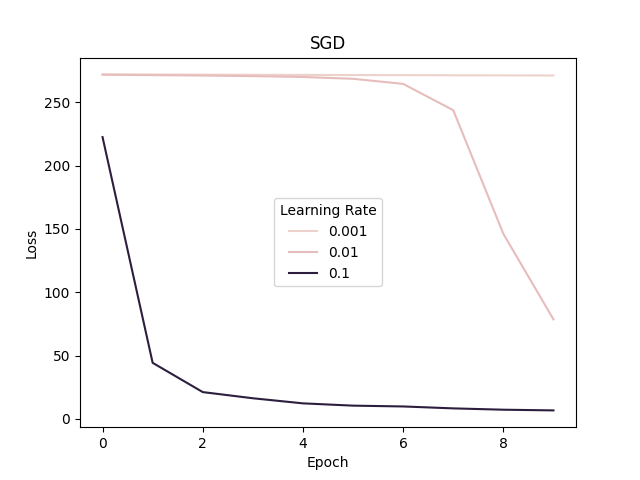
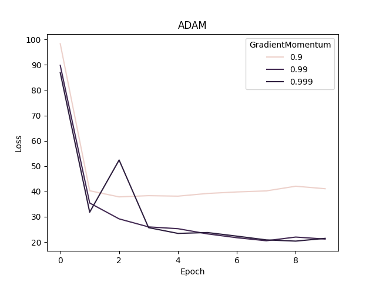

## <center> CSE 543: Homework I </center>
#### <center> Corbin Charpentier (Student ID: 2129849) </center>
## Q1
We have $g:[0,1]\rightarrow \mathbb{R}$ and is twice-differentiable with $g(0)=g'(0)=0$.
### Q1.1
By the Fundamental Theorem of Calculus, we have:

$$
\begin{align}
g'(x)  &= g'(0)+\int_0^x g''(b)db \\
g(x)   &= g(0) + \int_0^x  \left (  g'(0)+\int_0^x g''(b)db \right)db \\
\end{align}
$$

Now plugging in what was given

$$
\begin{align}
g(x) &= 0 + \int_0^1  \left ( 0 + \int_0^1 \sigma(x-b) g''(b)db \right)db \\
     &= \int_0^1  \int_0^1 \sigma(x-b) g''(b)db db \\
     &= \int_0^1  \sigma(x-b) g''(b)db  \\
\end{align}
$$
Step $(3)$ gets us back to the original proposition. 

### Q1.2
Suppose $\left|g^{\prime \prime}\right| \leq \beta$ over $[0,1]$ for some $\beta>0$, and let $\epsilon>0$ be given. Prove that there exists a ReLU network $f(x) \triangleq \sum_{i=1}^{m} a_{i} \sigma\left(x-b_{i}\right)$ with $m \leq\left\lceil\frac{\beta}{\epsilon}\right\rceil$ and $\|f-g\|_{\infty} \leq \epsilon$

$g'$ is by definition $\beta$-Lipschitz. (Wikipedia)

By 1D Approximation theorem in the lecture notes, a 2-layer neural network $f$ exists with the following attributes:

The neural network as $\left\lceil\frac{\beta}{\epsilon}\right\rceil$ nodes 

The neural network can be expressed with: $f(x)=\sum_{i=1}^{m} a_{i} \mathbb{1}_{x-x_{i} \geq 0}$

$\left\|f-g^{\prime}\right\|_{\infty}\leq\epsilon$

We let 

$x_{i} \triangleq \frac{(i-1) \epsilon}{\beta}$

$m \triangleq\left\lceil\frac{\beta}{\epsilon}\right\rceil$ 

$a_{i} \triangleq |g^{\prime}\left(x_{i}\right)-g^{\prime}\left(x_{i-1}\right)|$

Now

||$f-g^{\prime} \|_{\infty} \leq \epsilon \implies \left|f(x)-g^{\prime}(x)\right| \leq \epsilon$ (1D proof)

Therefore

$||\int(f-g^{\prime}) \|_{\infty} \leq \epsilon \implies \left|\int (f(x)-g^{\prime}(x))\right| \leq \epsilon$

Which implies
$f(x)=x\sum_{i=1}^{m} a_{i} \mathbb{1}_{x-x_{i} \geq 0} = \sum_{i=1}^{m} a_{i} \sigma\left(x-b_{i}\right)$ for all $b_i=0$

Since $\sigma(x) = x * threshold(x)$

$$
\begin{aligned}
\end{aligned}
$$

## Q2
Suppose $f: \mathbb{R}^{d} \rightarrow R$ is locally Lipschitz and positively homogeneity of degree $L$ (a function $g$ is positive homogeneous of degree $L$ if $g(\alpha x)=\alpha^{L} g(x)$ for any $\alpha \geq 0$ ). We will prove that for any given $x \in \mathbb{R}^{d}$, for $s \in \partial f(x)$, we have $\langle s, x\rangle=L f(x)$. Here $\partial f(x)$ is Clarke Differential.

### Q2.1 
Show that when $x=0$, and $s \in \partial f(x)$, we have $\langle s, x\rangle=L f(x)$.

By definition of homogeneity, we have:
$g(\alpha x)=\alpha^{L} g(x)$. Plugging in $x=0$, we get:
$$
\begin{aligned}
&f(\alpha*0) = \alpha^{L} f(0) \\
&\implies f(0) = \alpha^{L} f(0) \\
&\implies 1 = \alpha^{L} \\
&\implies L = log_\alpha{1} = 0 \\
& \text{where } f(0) \neq 0
\end{aligned}
$$

And trivially, since $x=0$:
$$
\begin{aligned}
\langle s, 0\rangle= 0
\end{aligned}
$$

And finally:
$$
\begin{aligned}
\langle s, x\rangle &=L f(x) \\
\langle s, 0\rangle &=0 * f(x) \\
0&=0 
\end{aligned}
$$

### Q2.2 
Show for all $x \neq 0$ such that $\nabla f(x)$ exists, $\langle\nabla f(x), x\rangle=L f(x)$.
Hint: You can use the following basic property about gradient:
$$
\lim _{\delta \rightarrow 0} \frac{f(x+\delta x)-f(x)-\langle\nabla f(x), \delta x\rangle}{\delta}=0 .
$$
Q2.3 (3 Points) Using the definition of Clarke Differential to show that for any given $x \in \mathbb{R}^{d}$, for $s \in \partial f(x)$, we have $\langle s, x\rangle=L f(x)$.

$$
\frac{d z_{t}}{d w_{1}}=\sum_{\tau<t} \frac{d z_{t}}{\partial z_{\tau}} \frac{d z_{\tau}}{\partial w_{1}}
$$

Using $f$'s homogeneity property (and some algebra), we manimuplate the limit as follows:

$$
\begin{align}
&\lim _{\delta \rightarrow 0} 
    \frac
        {f(x+\delta x)-f(x)-\langle\nabla f(x), \delta x\rangle}
        {\delta}=0 \\
\end{align}
$$

$$
\begin{align}
&\implies \lim _{\delta \rightarrow 0} 
    \frac
        {(1+\delta)^Lf(x) - f(x) - \delta\langle\nabla f(x), x\rangle}
        {\delta}=0 \\
\end{align}
$$

$$
\begin{align}
&\implies \lim _{\delta \rightarrow 0} 
    \frac
        {f(x)((1+\delta)^L - 1) - \delta\langle\nabla f(x), x\rangle}
        {\delta}=0 \\
\end{align}
$$
        
$$
\begin{align}
&\implies \lim _{\delta \rightarrow 0} 
    \frac
        {f(x)(1+\delta+\delta^2+...+\delta^L  - 1) - \delta\langle\nabla f(x), x\rangle}
        {\delta}=0 \\
\end{align}
$$

$$
\begin{align}
&\implies \lim _{\delta \rightarrow 0} 
    \frac
        {f(x)(\delta+\delta^2...+\delta^L) - \delta\langle\nabla f(x), x\rangle}
        {\delta}=0 \\
\end{align}
$$

$$
\begin{align}
&\implies \lim _{\delta \rightarrow 0} 
        f(x)(1 + \delta+\delta^2...+\delta^{L-1}) = 
        \lim _{\delta \rightarrow 0} \langle\nabla f(x), x\rangle\\
\end{align}
$$

$$
\begin{align}
&\implies f(x) * \lim _{\delta \rightarrow 0} 
        (1 + \delta)^{l-1} = 
        \langle\nabla f(x), x\rangle\\
\end{align}
$$

$$
\begin{align}
&\implies f(x)*1 = \langle\nabla f(x), x\rangle\\
\end{align}
$$

And indeed, it can be observed that the only value of $L$ that satisfies $L$-homogeneity ($Lf(x)=f(xlog_{\alpha}(L))$) is $1$. 

### Q2.3 
Using the definition of Clarke Differential to show that for any given $x \in \mathbb{R}^{d}$, for $s \in \partial f(x)$, we have $\langle s, x\rangle=L f(x)$.

We only need to show that $\langle s, x\rangle=L f(x)$ is true everywhere that $x \ne 0$ and $\nabla f(x)$ does not exist, since these two cases have already been proven, and because $f$ is given to be locally $\rho$-Lipschitz, we know that $\forall x \in S$, where $S$ is a neighborhood of $f$, $\partial f(x)$ exists.

Note the definition of the Clarke Differential:
$$
\partial f(x):=\operatorname{conv}\left(\left\{s \in \mathbb{R}^{d}: \exists\left\{x_{i}\right\}_{i=1}^{\infty} \text { s.t. } x_{i} \rightarrow x, \nabla f\left(x_{i}\right) \rightarrow s\right\}\right)
$$

Therefore, using the proof from Q2.2, there is guaranteed to be an $s \in \partial f(x)$ that satifies $\langle s, x\rangle=L f(x)$. 

## Q3
### Q3.1
$$
f\left(w_{1}, w_{2}\right)=\left(\sin \left(2 \pi w_{1} / w_{2}\right)+3 w_{1} / w_{2}-\exp \left(2 w_{2}\right)\right) \cdot\left(3 w_{1} / w_{2}-\exp \left(2 w_{2}\right)\right)
$$

1. $z_{1}=w_{1} / w_{2}$
2. $z_{2}=\sin \left(2 \pi z_{1}\right)$
3. $z_{3}=\exp \left(2 w_{2}\right)$
4. $z_{4}=3 z_{1}-z_{3}$
5. $z_{5}=z_{2}+z_{4}$
6. $z_{6}=z_{4} z_{5}$
7. $y=z_6$

Compute $\frac{df}{dw} = \frac{dz_6}{TODO}$
 asdf
1. $\bar{w_1} = \bar{z_1}\frac{dz_1}{dw_1} = \frac{1}{\bar{w_2}}$

   $\bar{w_2} = \bar{z_1}\frac{dz_1}{dw_2} = -\frac{\bar{w_1}}{(\bar{w_2})^2}$

2. $\bar{z_1} = \bar{z_2}\frac{dz_2}{dz_1} = 2 \pi \cos \left(2 \pi z_{1}\right)$ 

3. $\bar{w_2} = \bar{z_3}\frac{dz_3}{dw_2} = 2 \exp \left(2 w_{2}\right)$

4. $\bar{z_1} = \bar{z_4}\frac{dz_4}{dz_1} = 3\bar{z_4}$

   $\bar{z_3} = \bar{z_4}\frac{dz_4}{dz_3} = -\bar{z_4}$

5. $\bar{z_2} = \bar{z_5}\frac{dz_5}{dz_2} = \bar{z_5}$

   $\bar{z_4} = \bar{z_5}\frac{dz_5}{dz_4} = \bar{z_5}$

6. $\bar{z_4} = \bar{z_6}\frac{dz_6}{dz_4} = \bar{z_6}\bar{z_5}$

   $\bar{z_5} = \bar{z_6}\frac{dz_6}{dz_5} = \bar{z_6}\bar{z_4}$

7. $\bar{z_6} = \bar{y} = 1$

TODO: pseudocode? Is this sufficient?

### Q3.2
We use the following formula to calculate the forward mode auto-differentiation for $w_1$ and $w_2$:
$$
\frac{d z_{6}}{d w_{k}}=\sum_{\tau<6} \frac{d z_{6}}{\partial z_{\tau}} \frac{d z_{\tau}}{\partial w_{k}} \text{where } k \in \{1, 2\}
$$

#### Q3.2.1
Assume we have already evaluated $(z_1, ...,z_6)$ identically to question Q3.1 and have the result stored in memory.

Next, we compute compute all the derivatives using the chain rule, first respect to $w_1$, then $w_2$:

When this pseudo code is actually implemented, the two snippets below will be abstracted into a common function that computes the forward auto-differnetiation.

Without further ado, compute $\frac{dz_6}{dw_2}$
1. $\bar{z_1} = \frac{dz_1}{dw_1} = \frac{1}{w_2}$

1. $\bar{z_2} = \sum_{\tau<2} \frac{d z_{2}}{\partial z_{\tau}} \frac{d z_{\tau}}{\partial w_1} = 2\pi \cos(2\pi \bar{z_1}) + \bar{z_1}$

1. $\bar{z_3} = \sum_{\tau<3} \frac{d z_{3}}{\partial z_{\tau}} \frac{d z_{\tau}}{\partial w_1} = 0 + 0 = 0$

1. $\bar{z_4} = \sum_{\tau<4} \frac{d z_{4}}{\partial z_{\tau}} \frac{d z_{\tau}}{\partial w_1} = 3\bar{z_1} + 0 + -\bar{z_3} = 3\bar{z_1} -\bar{z_3}$

1. $\bar{z_5} = \sum_{\tau<5} \frac{d z_{5}}{\partial z_{\tau}} \frac{d z_{\tau}}{\partial w_1} = 0 + \bar{z_2} + 0 + \bar{z_4} = \bar{z_2} + \bar{z_4}$

1. $\bar{z_6} = \sum_{\tau<6} \frac{d z_{6}}{\partial z_{\tau}} \frac{d z_{\tau}}{\partial w_1} = 0 + 0 + 0 + (\bar{z_4}z_5) + (z_4\bar{z_5}) = \bar{z_4}z_5 + z_4\bar{z_5} $

Finally: $\frac{dz_6}{dw_1} = \bar{z_6}$

Now compute $\frac{dz_6}{dw_1}$

1. $\bar{z_1} = \frac{dz_1}{dw_2} = \frac{w_2}{w_2^2}$

1. $\bar{z_2} = \sum_{\tau<2} \frac{d z_{2}}{\partial z_{\tau}} \frac{d z_{\tau}}{\partial w_2} = 0$

1. $\bar{z_3} = \sum_{\tau<3} \frac{d z_{3}}{\partial z_{\tau}} \frac{d z_{\tau}}{\partial w_2} = 2\exp(2w_2)$

1. $\bar{z_4} = \sum_{\tau<4} \frac{d z_{4}}{\partial z_{\tau}} \frac{d z_{\tau}}{\partial w_2} = \bar{z_1} + 0 + -\bar{z_3} = 3\bar{z_1} -\bar{z_3}$

1. $\bar{z_5} = \sum_{\tau<5} \frac{d z_{5}}{\partial z_{\tau}} \frac{d z_{\tau}}{\partial w_1} = 0 + \bar{z_2} + 0 + \bar{z_4} = \bar{z_2} + \bar{z_4}$

1. $\bar{z_6} = \sum_{\tau<6} \frac{d z_{6}}{\partial z_{\tau}} \frac{d z_{\tau}}{\partial w_1} = 0 + 0 + 0 + (\bar{z_4}z_5) + (z_4\bar{z_5}) = \bar{z_4}z_5 + z_4\bar{z_5} $

Finally: $\frac{dz_6}{dw_2} = \bar{z_6}$

#### Q3.2.2
We'd need to compute chain of derivatives with respect to each dimension in the input vector $w \in \mathbb{R}^d$. 

### Q3.2.3
Since $T$ computations are required for reach input variable $d$ , the upper bound is:
$$O(dT)$$

## Q4
### Q4.1
### Gradient Descent


Batch size: all data; Number of epochs: 10

### Minibatch SGD


Batch size: 128; Number of epochs: 10



Batch size: 512; Number of epochs: 10

### AdaGrad


Batch size: 128; Learning decay: 0.9; Number of epochs: 10


Batch size: 128; Learning decay: 0.09; Number of epochs: 10


Batch size: 128; Learning decay: 0.009; Number of epochs: 10

### Adam


Batch size: 128; $\beta_1$: 0.9; $\beta_2$: 0.999; Number of epochs: 10



Batch size: 128; $\beta_1$: 0.9; $\beta_2$: 0.999; Number of epochs: 10


Batch size: 128; $\beta_1$: 0.9; $\beta_2$: 0.999; Number of epochs: 10

### 4.2
While adaptive optimization algorithms (e.g. Adam and AdaGrad) seem to converge faster, they don't seem to generalize as well as simple SGD (this is not a conclusion drawn from the tests here). However, [recent research](https://arxiv.org/abs/1910.05446) suggests might be simply a matter of hyper parameter tuning (adaptive strategies have more hyperparemeters). 

Now pivoting to vanilla gradient descent vs mini-batch SGD, the principle advantage of mini-batch memory usage; it does not require the entire dataset to be in memory like VGD, which is intractible for large datasets. 

## CODE
```
import torch
import torch.nn as nn
import torch.nn.functional as F
import torch.optim as optim
from torch.utils.data import DataLoader

import torchvision
from torchvision.datasets import MNIST
from torchvision import transforms

import numpy as np
import pandas as pd
import seaborn as sns

DEBUG_MODE = True 
def pp(s):
    if(DEBUG_MODE):
        print(s)

class Net(nn.Module):

    def __init__(self):
        super(Net, self).__init__()
        # 1 input image channel, 6 output channels, 5x5 square convolution
        # kernel
        self.conv1 = nn.Conv2d(1, 6, 5)
        self.conv2 = nn.Conv2d(6, 16, 5)
        # an affine operation: y = Wx + b
        self.fc1 = nn.Linear(16 * 5 * 5, 120)  # 5*5 from image dimension
        self.fc2 = nn.Linear(120, 84)
        self.fc3 = nn.Linear(84, 10)

    def forward(self, x):
        # Max pooling over a (2, 2) window
        x = F.max_pool2d(F.relu(self.conv1(x)), (2, 2))
        # If the size is a square, you can specify with a single number
        x = F.max_pool2d(F.relu(self.conv2(x)), 2)
        x = torch.flatten(x, 1) # flatten all dimensions except the batch dimension
        x = F.relu(self.fc1(x))
        x = F.relu(self.fc2(x))
        x = self.fc3(x)
        return x


    def fit(self, batches, loss_fn, optimizer, epochs_n=10): # TODO: change back to 10
        loss_per_epoch = []

        for i in range(epochs_n):
            batch_loss = 0
            pp(f"### Epoch #{i}")

            self.train()
            for image, label in batches:
                optimizer.zero_grad()
                net_output = self(image)
                loss_output = loss_fn(net_output, label)
                loss_output.backward()
                optimizer.step()
                batch_loss += loss_output.item()

            loss_per_epoch.append(batch_loss)
            pp(f"   loss for this epoch: {loss_per_epoch[i]}" )

        return loss_per_epoch 

# setup data
train_data_raw = MNIST(
    root='data', 
    train=True, 
    transform=torchvision.transforms.Compose(
        [
            torchvision.transforms.Resize(32),
            torchvision.transforms.ToTensor(),
        ]), 
    download=True
)

# TODO: all of these *Experiment functions can be generalized further
def sgdExperiments(learning_rates, batch_sizes):
    experiments = []
    for batch_size in batch_sizes:
        for lr in learning_rates:
            net = Net()
            experiments.append({
                "net": net,
                "optimizer": optim.SGD(net.parameters(), lr=lr),
                "batch_size": batch_size,
            })

    def plot(exps_data):
        do_plot(
            exps_data,
            batch_sizes,
            learning_rates,
            "Batch Size", "Learning Rate",
            "SGD",
        )

    return {"plot_fn": plot, "exps": experiments}

def adaGradExperiments(learning_rates, decays, batch_size=128):
    experiments = []
    for decay in decays:
        for lr in learning_rates:
            net = Net()
            experiments.append({
                "net": net,
                "optimizer": optim.Adagrad(net.parameters(), lr=lr, lr_decay=decay),
                "batch_size": batch_size,
            })

    def plot(exps_data):
         do_plot(
            exps_data,
            decays,
            learning_rates,
            "Decay", "Learning Rate",
            "AdaGrad",
        )

    return {"plot_fn": plot, "exps": experiments}

def adamExperiments(adaptive_momentum, gradient_momentum, batch_size=128):
    experiments = []
    for am in adaptive_momentum:
        for gm in gradient_momentum:
            net = Net()
            experiments.append({
                "net": net,
                "optimizer": optim.Adam(net.parameters(), lr=0.01, betas=(am, gm)),
                "batch_size": batch_size,
            })

    def plot(exps_data):
         do_plot(
            exps_data,
            adaptive_momentum,
            gradient_momentum,
            "Adaptive Momentum", "GradientMomentum",
            "ADAM",
        )

    return {"plot_fn": plot, "exps": experiments}


def do_plot(exps_data, plt_params, hue_params, plt_param_name, hue_param_name, title):
    exp_i = 0
    column_names = [plt_param_name, hue_param_name, "Loss", "Epoch"] 
    df = pd.DataFrame(columns=column_names)

    # Construct the data grame
    for plt_param in plt_params:
        for hue_param in hue_params:
            for epoch_i, epoch_loss in enumerate(exps_data[exp_i]):
                new_row = pd.DataFrame(columns=column_names)
                new_row.loc[0] = [plt_param, hue_param, epoch_loss, epoch_i]
                df = pd.concat([df, new_row], ignore_index=True)
            exp_i += 1

    pp(df)
    pp(hue_params)

    for plt_param in plt_params:
        sns.color_palette("Set2")
        plot = sns.lineplot(
            data=df[df[plt_param_name] == plt_param], x="Epoch", y="Loss", hue=hue_param_name, ci=None
        ).set_title(title)
        plot.figure.savefig(f"{title}_{plt_param}.png")
        plot.figure.clf()


# Declare the experiments we're going to run. This is the program! 
experiments = [ # [Hypers]
    sgdExperiments([0.001, 0.01, 0.1], [60000]),
    sgdExperiments([0.001, 0.01, 0.1], [128, 512]),
    adaGradExperiments([0.001, 0.01, 0.1], [0.9, 0.09, 0.009]),
    adamExperiments([0.9, 0.5, 0.1], [0.999, 0.99, 0.9]),
]

for exp_class in experiments:
    history = []

    for exp in exp_class["exps"]:
        net = exp["net"]

        train_batches = DataLoader(train_data_raw, batch_size=exp["batch_size"], shuffle=True)

        history.append(net.fit(
            train_batches, 
            nn.CrossEntropyLoss(),
            exp["optimizer"],
        ))

    exp_class["plot_fn"](history)

```